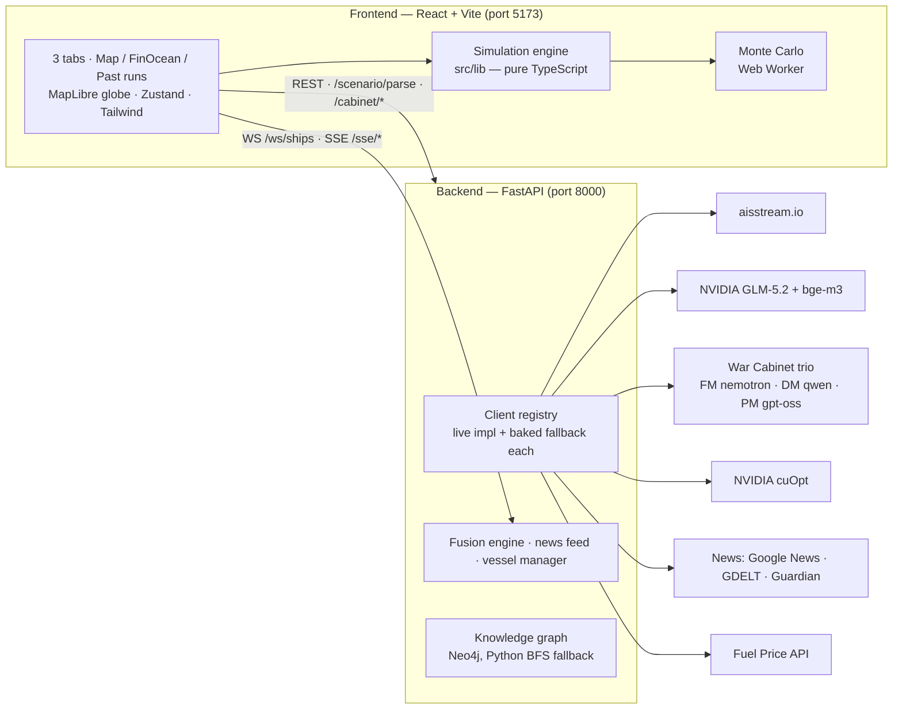

# Mr. Vessel 🚢

**The oil crisis, simulated before it's real.**

Mr. Vessel is India's energy shock simulator. Pick a crisis — a blocked Strait of Hormuz, a sanctioned tanker, an OPEC+ production cut — and watch the cascade unfold over 90 days: crude price → import cost → petrol price at a Delhi pump → power-grid stress → GDP growth. Or convene a **War Cabinet**: describe a crisis in plain English and three AI ministers debate the response.

Everything runs in the browser on a live 3D globe, backed by real data: **1,589 real Indian power plants**, **5,388 vessels screened against OpenSanctions**, live AIS ship positions, a live corridor-risk model that reacts to the news feed, and a price model calibrated on the 2022 oil shock.

---

## Table of contents

- [What you can do](#what-you-can-do)
- [How the model works](#how-the-model-works)
- [Honesty rules](#honesty-rules)
- [Architecture](#architecture)
- [Getting started](#getting-started)
- [API keys (all optional)](#api-keys-all-optional)
- [Deploying (Render)](#deploying-render)
- [Backend API](#backend-api)
- [Project structure](#project-structure)
- [Testing](#testing)
- [Known limits](#known-limits)
- [Changelog](CHANGELOG.md)

---

## What you can do

The app opens on a landing film, then hands off to a three-tab instrument. **FinOcean Maximus** is the workbench — it holds the dashboard, ship simulator, AI cabinet and brief as cards on one page.

### 🎬 Landing
A full-bleed film with the headline and three live counters (vessels tracked, corridors watched, historical shocks) fading up over it. 5s before the clip ends an **Enter the Command Window** link appears; 1.5s before the end the hero slides away and hands off to the instrument on its own — once per session, so coming back to the landing never yanks you off it again. `prefers-reduced-motion` holds a still frame and never auto-navigates.

### 🌍 Command Map
A live 3D globe of India's energy system — every power plant (colored by fuel), oil tankers on their actual AIS positions, and the five chokepoints India's crude flows through (Hormuz, Bab el-Mandeb, Suez, Malacca, Cape of Good Hope).

- **Corridor risk panel** — for each chokepoint, the chance of disruption in the next 30 days, with an uncertainty band and the news/ship signals driving it. Click one to see the ships currently transiting it. Two of the four signals are **derived live**: sanctions from the screened fleet, and news from the headline feed — so an active-conflict corridor rises on its own (a severity-5 war report pushes the news signal to its ceiling). The map polygons and the panel read the *same* fused values, so they can never disagree.
- **"If Hormuz is blocked…" slider** — drag it and watch refinery run-rate, Delhi petrol price, electricity at risk, and GDP hit update live.
- **Signals rail** — corridor-relevant headlines on a rolling **7-day window**, grouped by day (Today / Yesterday / …) so you can scroll back through the week. Each is tagged to the chokepoint it affects.
- **Cascade carousel** — walks the Supplier → … → Sector chain one stage at a time, framing the real places on the map. It never advances on its own: step it with next/prev, or press ▶ to walk the chain on demand.
- **Ship / plant panels** — click anything on the map. Tankers show their cargo estimate, destination, ETA, and a sanctions screening result with the matched list.

### 🧭 FinOcean Maximus
One page that composes a whole scenario. Each input card is an editor you open, configure, and **Load** — and *loading is committing*: editing a card never changes what a run reads until you press Load, so a run is always reproducible from the committed world state.

1. **Simulation Dashboard** *(input)* — India's import mix (nine supplier sliders) plus the shock levels (Hormuz closure %, Red Sea suspension %, OPEC+ cut depth).
2. **Ship Simulator** *(input)* — pick a real tanker, choose what happens to it, and **LOAD SHIP → RUN** commits it to the affected-ship set. Ships already committed are listed in an **Affected ships · loaded** strip so nothing is a hidden input.
3. **Run** — the middle of the page. The run mode is derived from what's loaded: *coupled* (mix × ships), *macro shock only*, or *ship effects only*.
4. **War Cabinet** *(output)* — a slide-in chat where three AI ministers deliberate (below).
5. **Strategy Brief** *(output)* — the full read-out: 90-day trajectories, suggested mitigation with a re-sourcing table, per-refinery run rates on a map of India, the affected ships, and a plain "how to do better" summary.

Outputs stay locked until you run; the whole scenario exports as **one PDF report**.

### ⚔️ War Cabinet
Describe a crisis in plain English — *"Iran mines the Strait of Hormuz, the US strikes Houthi sites near Bab-el-Mandeb, OPEC+ cuts 3 Mb/d"* — and three AI ministers deliberate the response.

- A **Foreign Minister** and a **Defence Minister** (two different NVIDIA-hosted models) each read the crisis and stream a point-of-view, then hand up a set of **real policy levers** — re-source imports, negotiate OPEC down, release the strategic reserve, deploy naval escorts, de-escalate, or (last resort) escalate.
- A **Prime Minister** (a third model) weighs both and issues the **final call** as its own lever set — adopt, blend, reject, or override.
- The deliberation runs in a **slide-in chat**: each prompt keeps its FM / DM / PM replies grouped together, the transcript persists across reloads, past prompts are browsable, and ministers build on the previous turns rather than restarting cold. It can be cleared at any time.
- Running a simulation convenes the cabinet **in the background** and invites you in — it never hijacks the screen mid-run.
- Tick the responses you want and they become part of the exported PDF, where each minister's levers are rendered as plain-English recommendations (no variable names, no raw weights).

The load-bearing rule: **the models do judgment, the engine does arithmetic.** No AI ever produces a number you see — ministers argue strategy and emit levers; the calibrated engine computes every outcome, under the same anti-hallucination guard as the rest of the app. A free-text prompt is parsed into disruption channels with a speculation gate ("Iran *threatens* to close Hormuz" is a threat, not an event → 0%), so tension can't be mistaken for a shock.

### 📊 Simulation Dashboard *(FinOcean input card)*
Set the two things a macro scenario needs, then press **Load**:

1. One or more shocks (Hormuz closure %, Red Sea suspension %, OPEC+ cut depth).
2. **India's import mix** — nine supplier sliders (Russia, Iraq, Saudi Arabia…) over a live-normalizing total.

Running it yields 90-day trajectories with Monte Carlo bands (computed in a Web Worker), refinery-by-refinery run rates, power-grid stress, a historical-analog card (which past crisis this most resembles), and a constrained mitigation suggestion — presented in the **Strategy Brief** and the exported PDF.

### 🛳️ Ship Simulator *(FinOcean input card)*
Take one real tanker and block its route. The map draws its normal path and the forced detour (red), and computes the added days and freight cost from the ship's own speed and cargo size. The detour is cross-checked against NVIDIA cuOpt's route optimizer when a key is present. **LOAD SHIP → RUN** commits that vessel to the affected-ship set, whose lost India-bound cargo feeds the shortfall.

### 🕰️ Past Simulations
Every run is filed here automatically, in one scrollable card beside an equally-sized comparison card. Each entry stores the **full committed world** — import mix, shocks, and affected ships with their positions — so **Load again** restores the entire scenario ready to re-run. Tick two runs to overlay their petrol-price and growth curves side by side.

A first visit is seeded with **two example runs** (Hormuz 50%, and Hormuz 50% + Red Sea 100%) so the page opens on a ready-made comparison. Both are computed by the real engine on the real supplier matrix — nothing is hand-written — and both carry a full world, so they load and re-run like any other.

---

## How the model works

The core is a deterministic cascade, in plain terms:

```
disruption  →  world crude price (Brent)  →  India's import cost
            →  Delhi pump price (policy-damped ×0.5)
            →  refinery run-rate (physical barrels lost, after SPR buffer)
            →  power-grid stress (oil/gas plants at risk)
            →  GDP growth hit (pp over 90 days)
```

Key modelling choices:

- **Every coefficient lives in one file** — [`frontend/src/lib/coefficients.json`](frontend/src/lib/coefficients.json). Each entry carries its value, plausible range, source citation, and as-of date. The cascade reads *only* from this file.
- **Indian pump prices are policy-damped.** Retail petrol doesn't track Brent 1:1 — the government absorbs shocks via excise cuts and OMC margins. The model applies a 0.5 pass-through, calibrated on the 2022 episode (95.6% match — see [Honesty rules](#honesty-rules) for what that number does and doesn't mean).
- **Three shocks, three characters.** Hormuz is a physical crude-artery cut; Red Sea is *freight-led* (ships reroute around Africa — delay and cost, not lost barrels); OPEC+ is *price-led* (no tanker is blocked). Combined scenarios sum shortfalls, supply losses, and freight days.
- **Uncertainty is first-class.** A Monte Carlo engine samples the coefficient ranges (in a Web Worker, so the UI never freezes) and every headline shows a **range** (e.g. "+₹12–19/L"), never a false-precision decimal.
- **One tanker can't move Brent.** A single sanctioned ship affects India through the domestic-scarcity channel only; the world price stays flat. That's correct behavior, not a bug.

---

## Honesty rules

The project's brand is honesty about what it knows. These rules are enforced in code and UI:

| Rule | What it means on screen |
|---|---|
| **Every number is traceable** | Results carry an ⓘ popover showing the formula and the cited coefficients behind them, tagged `live` / `derived` / `cited` — on the Simulation Dashboard and inside the detail decks, where the reasoning lives. The map rails show the same figures clean; their provenance is one click away on the dashboard. |
| **"Live" means live** | Features driven by baked snapshots are labeled "computed (snapshot \<date\>)", never "Live". Ship panels declare *live AIS* vs *demo fleet*. |
| **Calibrated ≠ validated** | The 95.6% match on the 2022 backtest is *calibration* (the damping was fitted to that episode), and the UI says so. |
| **Ranges, not decimals** | Headlines quote Monte Carlo bands, e.g. "+₹12–19/L". |
| **Risk answers "of what, by when"** | Every probability is labeled with its 30-day horizon. |
| **AI narration can't hallucinate numbers** | The GLM-written analysis is checked number-by-number against the model's own facts; a single unverifiable number discards the whole narration and a grounded template is shown instead. |
| **AI decides, the engine computes** | In the War Cabinet the AI ministers never produce a number on screen — they argue strategy and emit *policy levers*, which are shown as plain-English recommendations. Every figure in the app and the report comes from the calibrated engine. The lever→outcome mapping (including the cap that stops diplomacy zeroing a mined strait) lives in the model layer and is unit-tested. |
| **No fake live calls** | Every external API sits behind an interface with a baked-data fallback — the full demo works with **zero API keys and no internet**. |

---

## Architecture



Two deliberate splits:

- **The simulation engine is pure TypeScript in the browser** ([`frontend/src/lib/`](frontend/src/lib/)). Sliders respond instantly, and the whole model is unit-testable without a server.
- **The backend only handles live-world I/O** — streaming ship positions, news polling, market prices, LLM narration, and route solving. If it's down (or you have no keys), the frontend falls back to baked snapshots in [`frontend/public/`](frontend/public/) and everything still works.

---

## Getting started

### Prerequisites

- **Node.js 20+** and **Python 3.11+**
- (Optional) **Docker**, only if you want the Neo4j-backed knowledge graph — there's a pure-Python fallback that gives identical answers.

### 1. Frontend (works standalone)

```bash
cd frontend
npm install
npm run dev        # → http://localhost:5173
```

With no backend running the app boots in **DEMO mode** on baked data — fully functional.

### 2. Backend (adds live feeds)

```bash
cd backend
pip install -r requirements.txt
uvicorn app.main:app --port 8000
```

Give it ~15 seconds to warm up (news + fusion startup), then check `http://localhost:8000/health`. The nav pill flips from **DEMO** to **LIVE** when feeds connect.

> **Note (Windows):** uvicorn does not hot-reload by default — restart it after backend edits, or run with `--reload`.

### 3. (Optional) Neo4j knowledge graph

```bash
# 7474 = Neo4j Browser (see the graph), 7687 = bolt (the app talks over this)
docker run -d --name vessel-neo4j -p 7474:7474 -p 7687:7687   -e NEO4J_AUTH=neo4j/vesselpass neo4j:5

# seed the 36 edges, then verify live == baked
cd backend && python -m app.kg        # -> "seeded 36 edges" + "cascade OK"
```

The `/kg/cascade` endpoint traverses the real graph when Neo4j is up (`mode: "live"`), and BFS-walks the same edge list in Python when it isn't (`mode: "baked"`) — the answers are asserted identical. Open **http://localhost:7474** (neo4j / vesselpass) to explore it visually:

```cypher
MATCH p=(s:Supplier)-[:SHIPS_VIA]->(:Chokepoint {name:'Hormuz'})
        -[:FEEDS|SUPPLIES|PRODUCES|DRIVES*1..4]->() RETURN p
```

30 nodes / 36 relationships across six layers (Supplier → Chokepoint → Port → Refinery → Product → Sector). The graph models **three** chokepoints — Hormuz, Red Sea, Suez; querying the other two falls back to `baked` with an empty result. Note the KG says "Red Sea" where the corridor-risk panel says "Bab el-Mandeb" for the same chokepoint, so those names don't join up.

### 4. Environment variables

Copy [`.env.example`](.env.example) to `.env` at the repo root (git-ignored — **secrets never go in code**). Every key is optional:

```bash
# backend — all optional; missing keys mean baked fallback for that feature
AIS_API_KEY=...          # aisstream.io  — live ship positions
NVIDIA_API_KEY=...       # build.nvidia.com — GLM-5.2 narration + bge-m3 embeddings
CUOPT_API_KEY=...        # NVIDIA cuOpt — route-detour cross-check
FUEL_PRICE_API_KEY=...   # fuel.indianapi.in — live Delhi pump price
GOOGLE_NEWS_API_KEY=...  # RapidAPI google-news13 — India-positioned headlines (primary)
GUARDIAN_API_KEY=...     # open-platform.theguardian.com — 7-day corridor backfill
CORS_ORIGINS=http://localhost:5173

# War Cabinet — one NVIDIA-hosted model per minister. Model ids have code defaults;
# override here if a catalog string differs. Each role can carry its own key (NVIDIA
# keys are often per-model); any *_API_KEY left blank falls back to NVIDIA_API_KEY.
FM_MODEL=nvidia/nvidia-nemotron-nano-9b-v2   # Foreign Minister
DM_MODEL=qwen/qwen3.5-122b-a10b              # Defence Minister
PM_MODEL=openai/gpt-oss-120b                 # Prime Minister (a distinct model)
FM_API_KEY=...           # Foreign Minister model key (blank → NVIDIA_API_KEY)
DM_API_KEY=...           # Defence Minister model key
PM_API_KEY=...           # Prime Minister model key

# neo4j (only if not using the docker defaults above)
NEO4J_URI=bolt://localhost:7687
NEO4J_USER=neo4j
NEO4J_PASSWORD=vesselpass
```

Frontend (only needed if the backend isn't on `localhost:8000`):

```bash
# frontend/.env
VITE_API_HTTP=http://localhost:8000
VITE_API_WS=ws://localhost:8000
```

---

## API keys (all optional)

| Key | Provider | Powers | Without it |
|---|---|---|---|
| `AIS_API_KEY` | [aisstream.io](https://aisstream.io) (free) | Live tanker positions over WebSocket | Baked demo fleet (labeled as such) |
| `NVIDIA_API_KEY` | [build.nvidia.com](https://build.nvidia.com) | AI narration (GLM-5.2) + semantic search over the crisis corpus (bge-m3); War Cabinet fallback | Grounded template text |
| `FM_API_KEY` · `DM_API_KEY` · `PM_API_KEY` | [build.nvidia.com](https://build.nvidia.com) | War Cabinet ministers (nemotron / qwen / gpt-oss). NVIDIA keys are often per-model — one key each | Blank → falls back to `NVIDIA_API_KEY`; if that's absent too, the cabinet reports unavailable |
| `CUOPT_API_KEY` | NVIDIA cuOpt managed API | Independent check of ship-detour routing | Local Haversine result stands alone |
| `FUEL_PRICE_API_KEY` | [fuel.indianapi.in](https://fuel.indianapi.in) | Live Delhi pump price (1-hour cache — free tier is 100 requests) | Baked snapshot price |
| `GOOGLE_NEWS_API_KEY` | [RapidAPI · google-news13](https://rapidapi.com) | Primary news source, positioned at India (`lr=en-IN`) | Falls through to GDELT, then Guardian, then the baked snapshot |
| `GUARDIAN_API_KEY` | [open-platform.theguardian.com](https://open-platform.theguardian.com) (free) | 7-day corridor backfill, so the Signals rail can scroll back a week immediately | Rail fills forward from live polls only |

**Rotate any key you've shared** (chat, screen share, demo recording) once you're done.

---

## Deploying (Render)

The repo ships a [`render.yaml`](render.yaml) Blueprint that stands up both services from one push:

- **`mr-vessel-api`** — the FastAPI backend as a Docker web service. It must be an *always-on
  container*: it holds SSE streams, a WebSocket, and background polling loops, so serverless
  function hosts can't run it.
- **`mr-vessel-web`** — the Vite frontend as a Static Site. It never sleeps, and reads the API URL
  from `VITE_API_HTTP` / `VITE_API_WS` at **build time**.

```bash
# 1. push, then on Render: New → Blueprint → pick this repo → Apply
# 2. add the secret keys on mr-vessel-api → Environment (all optional; baked fallback
#    without them). Cabinet secrets: FM_API_KEY, DM_API_KEY, PM_API_KEY (model ids are
#    non-secret and already declared in render.yaml).
# 3. verify
curl https://mr-vessel-api.onrender.com/health     # {"status":"ok",...}
```

Notes:
- `onrender.com` subdomains are global — if a name is taken, Render appends a suffix; update
  `VITE_API_HTTP` / `VITE_API_WS` and `CORS_ORIGINS` in `render.yaml` to the real URLs and redeploy
  the frontend (Vite inlines those at build time).
- **Neo4j isn't deployed** — the cascade endpoint falls back to the identical Python BFS (`mode: "baked"`). Run it locally to serve the real graph.
- On Render's free tier the backend sleeps after ~15 min idle (~40s cold start). The app still loads
  and works on baked data during that window, then upgrades to live once the API wakes. Ping
  `/health` before a demo (or use a free uptime pinger) to keep it warm.
- Build the backend image locally first if you change it: `docker build -t mrv-api . && docker run -p 8000:8000 mrv-api`.

---

## Backend API

| Endpoint | What it returns |
|---|---|
| `GET /health` | Which clients are live vs baked, key status |
| `GET /market/brent` | Current Brent price (USD) |
| `GET /market/pump` · `GET /market/pump/history` | Delhi petrol price, live + accumulated history |
| `POST /route/solve` | cuOpt shortest-path cost for a day-matrix (used by the Ship Simulator cross-check) |
| `GET /kg/cascade?chokepoint=…` | Supplier → chokepoint → port → refinery → product → sector cascade graph |
| `POST /scenario/parse` | War Cabinet: free-text crisis → disruption channels (σ), instant keyword parse with a speculation gate |
| `POST /cabinet/minister?role=fm\|dm` | War Cabinet: stream a minister's POV + structured policy levers (SSE; per-role model, GLM fallback) |
| `POST /cabinet/pm` | War Cabinet: stream the Prime Minister's verdict + final levers (runs on its own model) |
| `GET /rag/analogs` | Nearest historical crisis episodes for a scenario signature |
| `POST /rag/narrate` | Grounded AI narration of a run (streamed, guard-checked) |
| `GET /sse/news` · `GET /sse/pi` | Server-sent events: news items, fused disruption-probability updates |
| `WS /ws/ships` | Ship position stream (live AIS overlaid on the baked fleet by MMSI) |

---

## Project structure

```
Mr. Vessel/
├── backend/
│   ├── requirements.txt
│   └── app/
│       ├── main.py           # FastAPI app + all endpoints
│       ├── config.py         # .env loading — secrets never in code
│       ├── clients/          # one client per external API, each with a baked fallback
│       │   ├── registry.py   #   Protocol interfaces + live/baked selection
│       │   ├── aisstream.py  #   live AIS WebSocket
│       │   ├── cuopt.py      #   NVIDIA cuOpt route solver
│       │   └── gdelt_news.py #   news: Google News → GDELT → Guardian, merged
│       │                     #     into a rolling 7-day de-duplicated window
│       ├── fusion.py         # fuses news + ships + market into corridor risk
│       ├── kg.py             # knowledge graph (Neo4j + Python fallback)
│       ├── rag.py            # historical-analog retrieval + narration guard
│       ├── scenario_parse.py # War Cabinet: crisis text → disruption channels (σ)
│       ├── cabinet.py        # War Cabinet: 3-model minister/PM streaming + policy levers
│       ├── news_feed.py      # polling loop with fallback absorption
│       └── vessels.py        # baked fleet + live AIS overlay by MMSI
└── frontend/
    ├── public/               # baked data: ships, news, plants, corridors,
    │                         #   sanctions index, history corpus, supplier mix
    └── src/
        ├── App.tsx           # landing hero → command window shell + nav
        ├── CommandApp.tsx    # the 3-tab instrument (lazy-loaded)
        ├── store.ts          # Zustand global state + committed `world` (Load = commit)
        ├── lib/              # THE MODEL — pure TS, fully unit-tested
        │   ├── coefficients.json  # single source of truth for every number
        │   ├── cascade.ts    #   disruption → price → GDP chain
        │   ├── simulate.ts   #   90-day trajectory engine
        │   ├── montecarlo.ts #   uncertainty bands
        │   ├── coupled.ts    #   import-mix × shock coupling + mitigation
        │   ├── impact.ts     #   affected ships → per-day India shortfall
        │   ├── runPlans.ts   #   policy levers → engine plans (lever→outcome rules)
        │   ├── warCabinet.ts #   War Cabinet: crisis parse + minister/PM stream orchestration
        │   ├── ministerProse.ts   # strips lever JSON / markdown out of minister prose
        │   ├── finoceanPdf.ts     # the 2-page PDF report (pdf-lib, ₹-capable font)
        │   ├── pastSims.ts   #   saved runs + their full committed world
        │   ├── risk.ts       #   corridor risk from news/ship signals
        │   ├── sanctions.ts  #   vessel screening
        │   ├── routeGraph.ts #   sea-route graph + detour math
        │   └── …
        ├── components/       # UI (globe, panels, charts)
        │   ├── Hero.tsx           #   landing film, counters, film-driven hand-off
        │   ├── GlobeMap.tsx       #   3D globe; corridors repaint on live risk
        │   ├── RiskPanel.tsx      #   corridor risk w/ per-signal provenance
        │   ├── FinOcean.tsx       #   the workbench: input cards → run → outputs
        │   ├── SimDashboard.tsx   #   import mix + shock editor
        │   ├── ShipSimulator.tsx  #   vessel picker + reroute map
        │   ├── CabinetChat.tsx    #   slide-in War Cabinet transcript
        │   ├── StrategyBrief.tsx  #   trajectories, mitigation, per-refinery map
        │   └── …
        ├── hooks/
        │   └── useCorridorRisks.ts  # ONE live-fused risk source (map + panel)
        └── workers/          # Monte Carlo Web Worker
```

---

## Testing

```bash
cd frontend
npm test          # 120 unit tests across the model layer (vitest)
npm run build     # type-check + production build

# War Cabinet backend checks (key-free — no NVIDIA_API_KEY needed):
cd ../backend
python -m app.test_scenario_parse   # speculation gate, geo resolver, partial-closure severity
python -m app.test_cabinet          # policy-lever validation + per-role model fallback
```

The tests cover the entire model layer — cascade math, Monte Carlo, sanctions screening, route detours, corridor risk, the 2022 backtest, the M0 scenario assertions, and the War Cabinet (crisis parsing, the lever→outcome mapping, and the rule that full diplomatic mitigation *reduces but never zeroes* a physical shock). These checks are treated as immutable: they are never weakened to make a change pass.

---

## Known limits

Stated plainly, because that's the point of the project:

- The 2022 backtest is **calibration, not validation** — an out-of-sample test (e.g. the 2019 Abqaiq attack) is on the roadmap.
- The FX channel is implicit inside the calibrated policy-damping, not modeled explicitly.
- Corridor risk weights are structural, not fitted — 27 historical events is too few to fit 5 signal weights honestly.
- Live feeds are best-effort: news sources rate-limit (GDELT aggressively by IP) and volunteer AIS coverage in the Gulf is thin, so baked snapshots (clearly labeled) carry the demo. The Signals rail never regresses to an older snapshot once real headlines have arrived.
- The Signals window fills to a full 7 days only where a source can serve a date range (the Guardian backfill); Google News returns "latest" only, so the rest accumulates as the app polls.
- India is modeled as a solvent price-taker: barrels reroute, they don't vanish. The physical branch is "logistics friction + SPR buffer", not starvation.
