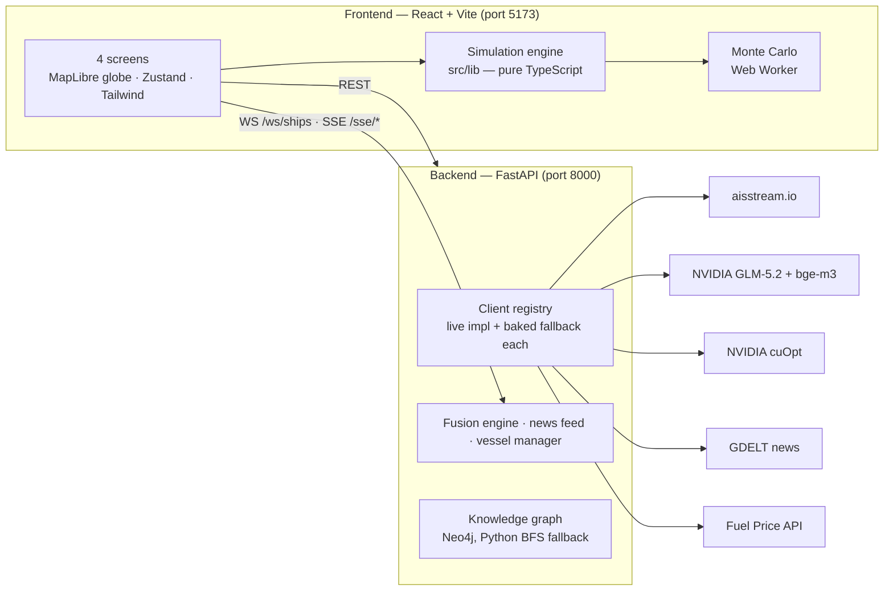

# Mr. Vessel 🚢

**See how a shock in the Gulf reaches India's pump price.**

Mr. Vessel is a geopolitical energy-disruption simulator for India. Pick a crisis — a blocked Strait of Hormuz, a sanctioned tanker, an OPEC+ production cut — and watch the cascade unfold over 90 days: crude price → import cost → petrol price at a Delhi pump → power-grid stress → GDP growth.

Everything runs in the browser on a live 3D globe, backed by real data: **1,589 real Indian power plants**, **5,388 vessels screened against OpenSanctions**, live AIS ship positions, and a price model calibrated on the 2022 oil shock.

---

## Table of contents

- [What you can do](#what-you-can-do)
- [How the model works](#how-the-model-works)
- [Honesty rules](#honesty-rules)
- [Architecture](#architecture)
- [Getting started](#getting-started)
- [API keys (all optional)](#api-keys-all-optional)
- [Backend API](#backend-api)
- [Project structure](#project-structure)
- [Testing](#testing)
- [Known limits](#known-limits)

---

## What you can do

The app is one page with four screens, reached from the top navigation:

### 🌍 Command Map
A live 3D globe of India's energy system — every power plant (colored by fuel), oil tankers on their actual AIS positions, and the five chokepoints India's crude flows through (Hormuz, Bab el-Mandeb, Suez, Malacca, Cape of Good Hope).

- **Corridor risk panel** — for each chokepoint, the chance of disruption in the next 30 days, with an uncertainty band and the news/ship signals driving it. Click one to see the ships currently transiting it.
- **"If Hormuz is blocked…" slider** — drag it and watch refinery run-rate, Delhi petrol price, electricity at risk, and GDP hit update live.
- **News rail** — corridor-relevant headlines, each tagged to the chokepoint it affects.
- **Ship / plant panels** — click anything on the map. Tankers show their cargo estimate, destination, ETA, and a sanctions screening result with the matched list.

### 📊 Simulation Dashboard
Build a full what-if scenario:

1. Choose one or more shocks (Hormuz closure %, Red Sea suspension %, OPEC+ cut depth).
2. Optionally adjust **India's import mix** (nine supplier sliders — Russia, Iraq, Saudi Arabia…).
3. Optionally add specific ships and choose what happens to them (sanctioned, delayed, rerouted).
4. Press **Run simulation**.

You get 90-day fan charts (petrol price and GDP with 5th–95th percentile bands from a Monte Carlo run in a Web Worker), refinery-by-refinery run rates, power-grid stress, a plain-language explanation of *why* the numbers moved, a historical-analog card (which past crisis this most resembles), and a constrained mitigation suggestion. Runs can be named, saved, and exported as PNG.

### 🛳️ Ship Simulator
Take one real tanker and block its route. The map draws its normal path and the forced detour (red), and computes the added days and freight cost from the ship's own speed and cargo size. The detour is cross-checked against NVIDIA cuOpt's route optimizer when a key is present. Push the result into the Simulation Dashboard to see what that single ship does to India's numbers.

### 🕰️ Past Simulations
Every saved run lands here — reopen it, reload it into the dashboard, or tick two runs to overlay their petrol-price and growth curves side by side.

---

## How the model works

The core is a deterministic cascade, in plain terms:

```
disruption  →  world crude price (Brent)  →  India's import cost
            →  Delhi pump price (policy-damped ×0.5)
            →  refinery run-rate (physical barrels lost, after SPR buffer)
            →  power-grid stress (oil/gas plants at risk)
            →  GDP growth hit (pp over 90 days)
```

Key modelling choices:

- **Every coefficient lives in one file** — [`frontend/src/lib/coefficients.json`](frontend/src/lib/coefficients.json). Each entry carries its value, plausible range, source citation, and as-of date. The cascade reads *only* from this file.
- **Indian pump prices are policy-damped.** Retail petrol doesn't track Brent 1:1 — the government absorbs shocks via excise cuts and OMC margins. The model applies a 0.5 pass-through, calibrated on the 2022 episode (95.6% match — see [Honesty rules](#honesty-rules) for what that number does and doesn't mean).
- **Three shocks, three characters.** Hormuz is a physical crude-artery cut; Red Sea is *freight-led* (ships reroute around Africa — delay and cost, not lost barrels); OPEC+ is *price-led* (no tanker is blocked). Combined scenarios sum shortfalls, supply losses, and freight days.
- **Uncertainty is first-class.** A Monte Carlo engine samples the coefficient ranges (in a Web Worker, so the UI never freezes) and every headline shows a **range** (e.g. "+₹12–19/L"), never a false-precision decimal.
- **One tanker can't move Brent.** A single sanctioned ship affects India through the domestic-scarcity channel only; the world price stays flat. That's correct behavior, not a bug.

---

## Honesty rules

The project's brand is honesty about what it knows. These rules are enforced in code and UI:

| Rule | What it means on screen |
|---|---|
| **Every number is traceable** | Each displayed figure has an ⓘ popover showing the formula and the cited coefficients behind it, tagged `live` / `derived` / `cited`. |
| **"Live" means live** | Features driven by baked snapshots are labeled "computed (snapshot \<date\>)", never "Live". Ship panels declare *live AIS* vs *demo fleet*. |
| **Calibrated ≠ validated** | The 95.6% match on the 2022 backtest is *calibration* (the damping was fitted to that episode), and the UI says so. |
| **Ranges, not decimals** | Headlines quote Monte Carlo bands, e.g. "+₹12–19/L". |
| **Risk answers "of what, by when"** | Every probability is labeled with its 30-day horizon. |
| **AI narration can't hallucinate numbers** | The GLM-written analysis is checked number-by-number against the model's own facts; a single unverifiable number discards the whole narration and a grounded template is shown instead. |
| **No fake live calls** | Every external API sits behind an interface with a baked-data fallback — the full demo works with **zero API keys and no internet**. |

---

## Architecture



Two deliberate splits:

- **The simulation engine is pure TypeScript in the browser** ([`frontend/src/lib/`](frontend/src/lib/)). Sliders respond instantly, and the whole model is unit-testable without a server.
- **The backend only handles live-world I/O** — streaming ship positions, news polling, market prices, LLM narration, and route solving. If it's down (or you have no keys), the frontend falls back to baked snapshots in [`frontend/public/`](frontend/public/) and everything still works.

---

## Getting started

### Prerequisites

- **Node.js 20+** and **Python 3.11+**
- (Optional) **Docker**, only if you want the Neo4j-backed knowledge graph — there's a pure-Python fallback that gives identical answers.

### 1. Frontend (works standalone)

```bash
cd frontend
npm install
npm run dev        # → http://localhost:5173
```

With no backend running the app boots in **DEMO mode** on baked data — fully functional.

### 2. Backend (adds live feeds)

```bash
cd backend
pip install -r requirements.txt
uvicorn app.main:app --port 8000
```

Give it ~15 seconds to warm up (news + fusion startup), then check `http://localhost:8000/health`. The nav pill flips from **DEMO** to **LIVE** when feeds connect.

> **Note (Windows):** uvicorn does not hot-reload by default — restart it after backend edits, or run with `--reload`.

### 3. (Optional) Neo4j knowledge graph

```bash
docker run -d --name vessel-neo4j -p 7687:7687 -e NEO4J_AUTH=neo4j/vesselpass neo4j:5
```

The `/kg/cascade` endpoint traverses the real graph when Neo4j is up, and BFS-walks the same edge list in Python when it isn't — the answers are asserted identical.

### 4. Environment variables

Create a `.env` at the repo root (it's git-ignored — **secrets never go in code**):

```bash
# backend — all optional; missing keys mean baked fallback for that feature
AIS_API_KEY=...          # aisstream.io  — live ship positions
NVIDIA_API_KEY=...       # build.nvidia.com — GLM-5.2 narration + bge-m3 embeddings
CUOPT_API_KEY=...        # NVIDIA cuOpt — route-detour cross-check
FUEL_PRICE_API_KEY=...   # fuel.indianapi.in — live Delhi pump price
CORS_ORIGINS=http://localhost:5173

# neo4j (only if not using the docker defaults above)
NEO4J_URI=bolt://localhost:7687
NEO4J_USER=neo4j
NEO4J_PASSWORD=vesselpass
```

Frontend (only needed if the backend isn't on `localhost:8000`):

```bash
# frontend/.env
VITE_API_HTTP=http://localhost:8000
VITE_API_WS=ws://localhost:8000
```

---

## API keys (all optional)

| Key | Provider | Powers | Without it |
|---|---|---|---|
| `AIS_API_KEY` | [aisstream.io](https://aisstream.io) (free) | Live tanker positions over WebSocket | Baked demo fleet (labeled as such) |
| `NVIDIA_API_KEY` | [build.nvidia.com](https://build.nvidia.com) | AI narration (GLM-5.2) + semantic search over the crisis corpus (bge-m3) | Grounded template text |
| `CUOPT_API_KEY` | NVIDIA cuOpt managed API | Independent check of ship-detour routing | Local Haversine result stands alone |
| `FUEL_PRICE_API_KEY` | [fuel.indianapi.in](https://fuel.indianapi.in) | Live Delhi pump price (1-hour cache — free tier is 100 requests) | Baked snapshot price |

**Rotate any key you've shared** (chat, screen share, demo recording) once you're done.

---

## Backend API

| Endpoint | What it returns |
|---|---|
| `GET /health` | Which clients are live vs baked, key status |
| `GET /market/brent` | Current Brent price (USD) |
| `GET /market/pump` · `GET /market/pump/history` | Delhi petrol price, live + accumulated history |
| `POST /route/solve` | cuOpt shortest-path cost for a day-matrix (used by the Ship Simulator cross-check) |
| `GET /kg/cascade?chokepoint=…` | Supplier → chokepoint → port → refinery → product → sector cascade graph |
| `GET /rag/analogs` | Nearest historical crisis episodes for a scenario signature |
| `POST /rag/narrate` | Grounded AI narration of a run (streamed, guard-checked) |
| `GET /sse/news` · `GET /sse/pi` | Server-sent events: news items, fused disruption-probability updates |
| `WS /ws/ships` | Ship position stream (live AIS overlaid on the baked fleet by MMSI) |

---

## Project structure

```
Mr. Vessel/
├── backend/
│   ├── requirements.txt
│   └── app/
│       ├── main.py           # FastAPI app + all endpoints
│       ├── config.py         # .env loading — secrets never in code
│       ├── clients/          # one client per external API, each with a baked fallback
│       │   ├── registry.py   #   Protocol interfaces + live/baked selection
│       │   ├── aisstream.py  #   live AIS WebSocket
│       │   ├── cuopt.py      #   NVIDIA cuOpt route solver
│       │   └── gdelt_news.py #   GDELT news polling
│       ├── fusion.py         # fuses news + ships + market into corridor risk
│       ├── kg.py             # knowledge graph (Neo4j + Python fallback)
│       ├── rag.py            # historical-analog retrieval + narration guard
│       ├── news_feed.py      # polling loop with fallback absorption
│       └── vessels.py        # baked fleet + live AIS overlay by MMSI
└── frontend/
    ├── public/               # baked data: ships, news, plants, corridors,
    │                         #   sanctions index, history corpus, supplier mix
    └── src/
        ├── App.tsx           # landing hero → command window shell + nav
        ├── CommandApp.tsx    # the 4-screen instrument (lazy-loaded)
        ├── store.ts          # Zustand global state
        ├── lib/              # THE MODEL — pure TS, fully unit-tested
        │   ├── coefficients.json  # single source of truth for every number
        │   ├── cascade.ts    #   disruption → price → GDP chain
        │   ├── simulate.ts   #   90-day trajectory engine
        │   ├── montecarlo.ts #   uncertainty bands
        │   ├── coupled.ts    #   import-mix × shock coupling + mitigation
        │   ├── risk.ts       #   corridor risk from news/ship signals
        │   ├── sanctions.ts  #   vessel screening
        │   ├── routeGraph.ts #   sea-route graph + detour math
        │   └── …
        ├── components/       # 24 UI components (globe, panels, charts)
        └── workers/          # Monte Carlo Web Worker
```

---

## Testing

```bash
cd frontend
npm test          # 92 unit tests across 15 files (vitest)
npm run build     # type-check + production build
```

The tests cover the entire model layer — cascade math, Monte Carlo, sanctions screening, route detours, corridor risk, the 2022 backtest, and the M0 scenario assertions. These checks are treated as immutable: they are never weakened to make a change pass.

---

## Known limits

Stated plainly, because that's the point of the project:

- The 2022 backtest is **calibration, not validation** — an out-of-sample test (e.g. the 2019 Abqaiq attack) is on the roadmap.
- The FX channel is implicit inside the calibrated policy-damping, not modeled explicitly.
- Corridor risk weights are structural, not fitted — 27 historical events is too few to fit 5 signal weights honestly.
- Live feeds are best-effort: GDELT rate-limits aggressively and volunteer AIS coverage in the Gulf is thin, so baked snapshots (clearly labeled) carry the demo.
- India is modeled as a solvent price-taker: barrels reroute, they don't vanish. The physical branch is "logistics friction + SPR buffer", not starvation.
